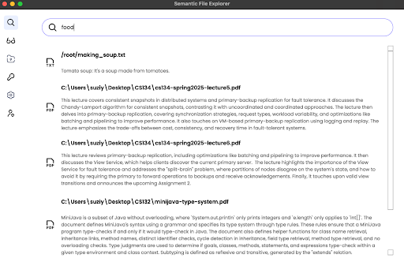

# Munchkin: Semantic File Explorer/Organizer

Ever felt like your downloads folder is too cluttered and wished that there was a tool to automatically organize it? Dissatisfied with the current search functionality of your operating system? You're in the right place!

Munchkin (`mckn`) offers a 2 pronged solution to your problems. It is comprised of 2 parts:

1. File sorting on download
2. Semantic file search

Most people are working on a bunch of things at the same time. If you're in school, you take a bunch of different classes. One of the uses of Munchkin is that you can configure it with a list of folder **associations**. Essentially, you **associate** a folder with a particular semantic meaning, for example, a class on compilers and programming languages, or a particular topic you're interested in, like archeology.

Next, our daemon runs in the background and watches the folders you configure for new files. When a file appears in one of the folders, Munchkin takes a look at the file and automatically decides which (if any) of the preconfigured folder associations best matches the content of the file. It then automatically moves the file into the folder with that association, keeping your downloads folder clean.

Furthermore, each supported file seen by Munchkin also has its metadata stored in a local database. When you want to search for a file, Munchkin performs a lookup and finds the file which best matches your query. No more headaches looking for a file just because it has a strange name!

## Features

Munchkin itself has 2 frontends, a CLI and a GUI. Choose whichever one you're more comfortable with. Example usages are below:

```
mckn start                 # Start the daemon
mckn stop                  # Stop the daemon
mckn find <query>          # Find a file using a query string
mckn watch add ~/Downloads # Add downloads folder to watch paths
mckn gui                   # Start the gui
...
```



## Installation

We've packaged up munchkin to make the installation process as simple as possible. Using [`uv`](https://docs.astral.sh/uv/) will make the installation process a lot faster.

```
cd lahacks2025
pip install -e .    # with pip
uv sync             # with uv
```